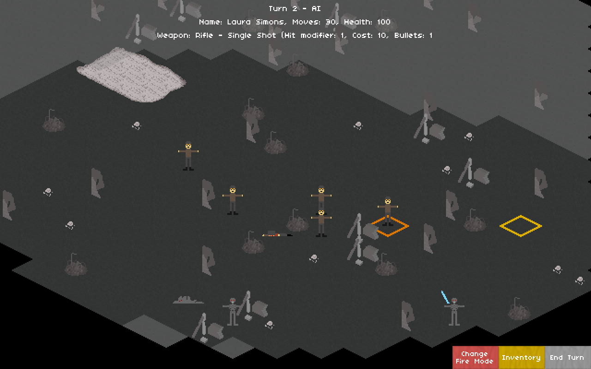

# War Against Machines

A (very WIP) turn-based strategy game set in the not-so-distant future.

Written in [Rust](https://www.rust-lang.org).

## Download

Releases can be found on the [releases page](https://github.com/expenses/war-against-machines/releases).

Note that as these releases are build automatically, I may not have personally tested them.

## Building

The game can be built with:

    cargo build --release

If you get an error like:

    thread 'main' panicked at 'called `Result::unwrap()` on an `Err` value: "`"pkg-config" "--libs" "--cflags" "alsa"` did not exit successfully: exit code: 1

This means that you will need to install the ALSA development libraries:

    sudo apt-get install libasound2-dev

## Gameplay

### Controls

Menu:
* `up`/`w` to move the selection up
* `down`/`s` to move the selection down
* `enter` to activate the selected item
* `left`/`a` to lower the value of the selected item
* `right`/`d` to raise the value of the selected item
* `escape` to quit

In a battle:
* `up`/`w` to move the camera up
* `down`/`s` to move the camera down
* `left`/`a` to move the camera left
* `right`/`d` to move the camera right
* `o` to zoom out
* `p` to zoom in
* `escape` to quit
* `left mouse button` to select the unit under the cursor
* `right mouse button` to perfom commands such as moving and firing